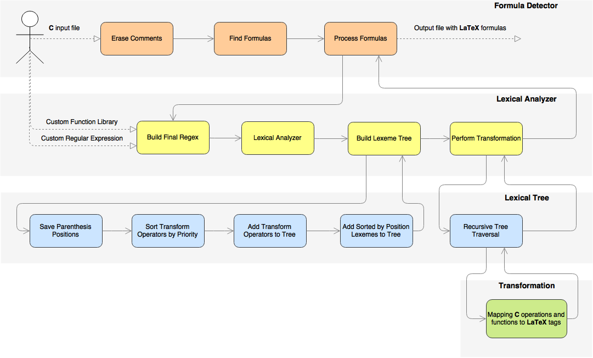

# CMath2Tex 

### Generates `LaTeX` math equations from `C` source code.

`CMath2Tex` is the tool to simplify documentation generation for source code with a lot of math expressions. 

`CMath2Tex` can help you in the following ways:  

* Quickly generates `LaTeX` equations for huge amount of math expressions in a source code.  
* Helps with representation of math formula in `LaTeX` format if you don't familiar with syntax.
* Generates `Doxygen`-friendly output

`CMath2Tex` is developed under macOS, but is set-up to be highly portable. As a result, it runs on Windows and  on a variety of Unix flavors as well.

# Table of Contents

- [Prerequisites](#prerequisites)
- [Getting started](#getting-started)
- [Usage](#usage)
- [Contributing](#contributing)
- [Documentation](#documentation)
- [Maintainers](#maintainers)
- [License](#license)

# Prerequisites

You will need [cmake](https://cmake.org) to build the project.

# Getting started

```
git clone https://github.com/galarius/cmath2tex.git
cd cmath2tex
mkdir build  && cd build
cmake -G "Unix Makefiles" ..
make
```

# Usage

* `cmath2tex.exe <input.c> <output.c>`  

* `cmath2tex.exe -i` - interactive mode

# Contributing

There are plenty of possible improvements ([Check for open issues](https://github.com/galarius/cmath2tex/issues)):

* Expansion of support for `LaTeX` syntax.  

* Generation of prettier output.  

* Test coverage.  

Here's a quick guide on `pull requests`:

1. [Check for open issues](https://github.com/galarius/cmath2tex/issues), or
   open a fresh issue to start a discussion around a feature idea or a bug.
   Opening a separate issue to discuss the change is less important for smaller
   changes, as the discussion can be done in the pull request.  
2. [Fork](https://github.com/galarius/cmath2tex.git) this repository on GitHub, and start making your changes.
3. Check out the README for information about the project setup and usage.
3. Push the change (it's recommended to use a separate branch for your feature).
4. Open a pull request.
5. I will try to merge and deploy changes as soon as possible, or at least leave
   some feedback, but if you haven't heard back from me after a couple of days,
   feel free to leave a comment on the pull request.

# Documentation 

`CMath2Tex` algorithm contains:
* `C` formula detection with regular expressions;
* Lexical analyzer;
* Operation tree to perform transformations from `C` to `LaTeX`.



See `CMath2Tex` [Documentation](https://galarius.github.io/cmath2tex/static/doc/index.html) that was built with `Doxygen`

# Maintainers
||
|-|
|[@Galarius](https://github.com/Galarius)|

# License

MIT License

Copyright (c) 2017 Shoshin Ilya

Permission is hereby granted, free of charge, to any person obtaining a copy
of this software and associated documentation files (the "Software"), to deal
in the Software without restriction, including without limitation the rights
to use, copy, modify, merge, publish, distribute, sublicense, and/or sell
copies of the Software, and to permit persons to whom the Software is
furnished to do so, subject to the following conditions:

The above copyright notice and this permission notice shall be included in all
copies or substantial portions of the Software.

 See the [MIT License](https://choosealicense.com/licenses/mit/) for more details.